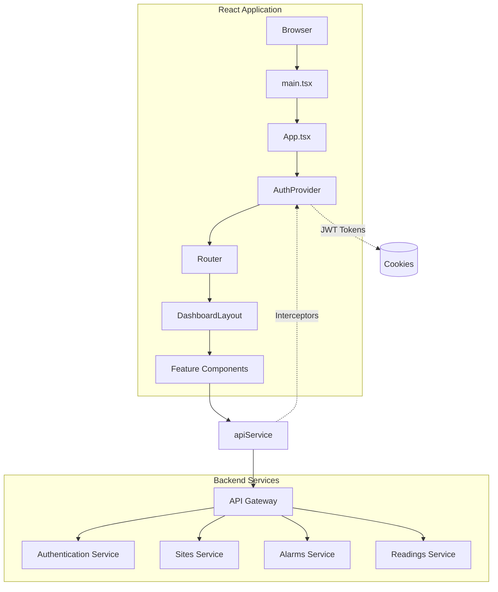
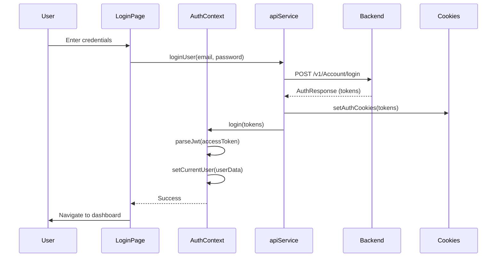

# UPS Frontend - Technical Documentation

**Version:** 0.1.0  
**Last Updated:** February 5, 2026

---

## Table of Contents

1. [Project Overview](#1-project-overview)
2. [Deployment Environment](#2-deployment-environment)
3. [Project Structure](#3-project-structure)
4. [Architecture & Design Patterns](#4-architecture--design-patterns)
5. [Core Components Documentation](#5-core-components-documentation)
6. [State Management](#6-state-management)
7. [Routing](#7-routing)
8. [Styling System](#8-styling-system)
9. [API Integration](#9-api-integration)
10. [Internationalization (i18n)](#10-internationalization-i18n)
11. [Authentication & Authorization](#11-authentication--authorization)
12. [Build & Deployment](#12-build--deployment)
13. [Performance Optimizations](#13-performance-optimizations)
14. [Accessibility (a11y)](#14-accessibility-a11y)
15. [Security Considerations](#15-security-considerations)
16. [Troubleshooting Guide](#16-troubleshooting-guide)

---

## 1. Project Overview

### Application Name & Version
**Admin Dashboard Design v0.1.0** - A comprehensive water infrastructure monitoring and management system.

### Description
This React-based dashboard application provides real-time monitoring and management capabilities for water pumping stations and water level monitoring sites. The system enables administrators and operators to track readings, configure alarms, manage sites, and monitor system health across multiple directorates.

### Key Features
- **Multi-role Access Control**: Admin and Operator roles with granular permissions
- **Real-time Dashboard**: Live monitoring of sites, alarms, and flow calculations
- **Site Management**: Comprehensive CRUD operations for water monitoring sites
- **Alarm Configuration**: Flexible alarm setup with multiple notification methods (Email, SMS)
- **Readings Management**: Historical data tracking and log viewing
- **Flow Calculations**: Support for formula-based calculations
- **Multilingual Support**: Full Arabic and English localization with RTL support
- **Responsive Design**: Mobile-first approach with adaptive layouts

### User Benefits
- Centralized monitoring of water infrastructure
- Proactive alarm management preventing system failures
- Data-driven insights through historical analysis
- Role-based access ensuring data security
- Intuitive interface reducing training time

### Technology Stack Summary

```typescript
Core Framework:
- React 18.3.1
- TypeScript (via Vite)
- React Router DOM 7.9.5

Build Tool:
- Vite 6.4.1 with SWC

UI Framework:
- Tailwind CSS 4.1.17
- Radix UI Components
- shadcn/ui component library
- Lucide React Icons

State & Data:
- React Context API (AuthContext)
- Custom hooks pattern
- Axios 1.13.2 for API calls

Form Management:
- React Hook Form 7.55.0
- Formik 2.4.9
- Yup 1.7.1 validation

Charts & Visualization:
- Recharts 2.15.2

Additional Libraries:
- i18next 25.7.3 (Internationalization)
- js-cookie 3.0.5 (Cookie management)
- jwt-decode 4.0.0 (Token parsing)
- react-toastify 11.0.5 (Notifications)
- xlsx 0.18.5 (Excel export/import)
```

---

## 2. Deployment Environment

### Browser Requirements

```bash
Browser: Modern browser with ES6+ support
  - Chrome: >= 90
  - Firefox: >= 88
  - Safari: >= 14
  - Edge: >= 90
```

### Deployment Platform

**Platform:** Vercel  
**Deployment URL:** Production environment accessible via Vercel hosting

### Environment Variables Configuration

The application uses the following API configuration in [`src/shared/utils/apiService.ts`](src/shared/utils/apiService.ts#L22):

```typescript
const API_BASE_URL = 'https://tele-dairot:5050/api';
```

### Build Configuration

**Vite Configuration** ([`vite.config.ts`](vite.config.ts)):
- React SWC plugin for optimized builds
- Path aliases (`@` → `./src`)
- Package version aliases for dependency resolution

**PostCSS Configuration** ([`postcss.config.cjs`](postcss.config.cjs)):
- Tailwind CSS processing
- Autoprefixer for browser compatibility

---

## 3. Project Structure

### Directory Tree (src/ focused)

```
UPS-Frontend/
├── src/
│   ├── features/              # Feature-based modules
│   │   ├── alarm-reports/     # Alarm reporting configuration
│   │   │   ├── components/
│   │   │   ├── hooks/
│   │   │   ├── types/
│   │   │   └── index.ts
│   │   ├── alarms/            # Alarm configuration & events
│   │   │   ├── components/
│   │   │   │   ├── AlarmConfiguration.tsx
│   │   │   │   └── AlarmEvents.tsx
│   │   │   ├── hooks/
│   │   │   ├── types/
│   │   │   └── index.ts
│   │   ├── auth/              # Authentication
│   │   │   ├── components/
│   │   │   │   └── LoginPage.tsx
│   │   │   ├── types/
│   │   │   │   └── index.ts   # User, LoginCredentials types
│   │   │   └── index.ts
│   │   ├── dashboard/         # Main dashboard
│   │   │   ├── components/
│   │   │   │   └── DashboardHome.tsx
│   │   │   ├── hooks/
│   │   │   │   └── useDashboardData.ts
│   │   │   ├── types/
│   │   │   └── index.ts
│   │   ├── flow-calculations/ # Flow calculation formulas
│   │   ├── readings/          # Readings & logs management
│   │   │   ├── components/
│   │   │   │   ├── ReadingsManagement.tsx
│   │   │   │   └── ReadingLogs.tsx
│   │   │   └── ...
│   │   ├── sites/             # Site management
│   │   │   ├── components/
│   │   │   │   ├── SitesManagement.tsx
│   │   │   │   └── dialogs/
│   │   │   ├── types/
│   │   │   │   └── index.ts   # Site, DataMapping types
│   │   │   ├── hooks/
│   │   │   │   └── useSitesData.ts
│   │   │   └── index.ts
│   │   └── users/             # User management
│   │       ├── components/
│   │       │   └── UserManagement.tsx
│   │       ├── hooks/
│   │       └── types/
│   │
│   ├── components/            # Shared/Layout components
│   │   ├── ui/                # shadcn/ui component library
│   │   │   ├── button.tsx
│   │   │   ├── card.tsx
│   │   │   ├── dialog.tsx
│   │   │   ├── table.tsx
│   │   │   ├── input.tsx
│   │   │   ├── select.tsx
│   │   │   ├── badge.tsx
│   │   │   ├── ... (40+ components)
│   │   │   ├── utils.ts       # cn() utility
│   │   │   └── index.ts
│   │   ├── DashboardLayout.tsx
│   │   └── LanguageSwitcher.tsx
│   │
│   ├── shared/                # Shared utilities & contexts
│   │   ├── components/
│   │   │   └── AlertDialog.tsx
│   │   ├── contexts/
│   │   │   └── AuthContext.tsx
│   │   └── utils/
│   │       ├── apiService.ts
│   │       ├── cookieService.ts
│   │       ├── formatters.ts
│   │       ├── jwtService.ts
│   │       └── index.ts
│   │
│   ├── i18n/                  # Internationalization
│   │   ├── index.ts
│   │   └── locales/
│   │       ├── ar.json
│   │       └── en.json
│   │
│   ├── lib/
│   │   └── utils.ts           # Tailwind class merging
│   │
│   ├── styles/
│   │   └── globals.css
│   │
│   ├── App.tsx                # Root component with routing
│   ├── main.tsx               # Application entry point
│   ├── index.css              # Tailwind CSS imports
│   └── vite-env.d.ts          # Vite type definitions
│
├── build/                     # Production build output
├── package.json
├── vite.config.ts
├── postcss.config.cjs
├── vercel.json                # Vercel deployment config
├── ARCHITECTURE.md            # Architecture documentation
└── README.md
```

### Key File Descriptions

| File/Directory | Purpose |
|----------------|---------|
| **src/main.tsx** | Application entry point, sets up React, Router, Toast, and i18n |
| **src/App.tsx** | Root component with authentication logic and route definitions |
| **src/components/DashboardLayout.tsx** | Main layout wrapper with sidebar navigation |
| **src/shared/contexts/AuthContext.tsx** | Global authentication state management |
| **src/shared/utils/apiService.ts** | Centralized Axios instance with interceptors |
| **src/i18n/index.ts** | i18next configuration for multilingual support |
| **src/components/ui/** | Reusable UI components from shadcn/ui |
| **src/features/** | Feature modules with self-contained logic |

### Module Organization Approach

The application follows a **Feature-Based Architecture** (documented in [`ARCHITECTURE.md`](ARCHITECTURE.md)):

**Benefits:**
- **Colocation**: Related code lives together
- **Scalability**: Easy to add new features without affecting existing ones
- **Maintainability**: Clear boundaries and reduced coupling
- **Discoverability**: Intuitive file organization

**Structure Pattern:**
```
feature-name/
├── components/     # React components specific to this feature
├── hooks/          # Custom hooks (e.g., useFeatureData)
├── types/          # TypeScript interfaces and types
├── utils/          # Feature-specific utility functions
├── services/       # API service methods (optional)
└── index.ts        # Public API exports
```

---

## 4. Architecture & Design Patterns

### System Architecture Diagram



### Component Architecture

**Pattern:** Feature-Based with Atomic Design Principles

The application uses a hybrid approach:

1. **Feature Modules**: High-level business features (sites, alarms, users)
2. **Shared Components**: Reusable UI components (buttons, cards, dialogs)
3. **Layout Components**: Application structure (DashboardLayout)

```typescript
// Feature component example
features/
  sites/
    components/
      SitesManagement.tsx      // Smart component (container)
      dialogs/
        SitesDialog.tsx         // Presentation component
```

### State Management Approach

**Primary Pattern:** React Context API + Custom Hooks

```typescript
// Global State: Authentication
<AuthProvider>
  ├── isAuthenticated: boolean
  ├── currentUser: User | null
  ├── handleLogout: () => Promise<void>
  └── refreshCurrentUser: () => void
</AuthProvider>

// Local State: Feature-specific hooks
useDashboardData() → { stats, sites, alarmEvents, ... }
useSitesData() → { sites, directorates, loading, error }
```

**State Hierarchy:**
1. **Global State (Context)**: Authentication, user preferences
2. **Server State (React Query pattern)**: API data with custom hooks
3. **Local State (useState)**: UI state, form inputs, filters

### Routing Strategy

**Pattern:** Declarative routing with React Router v7

```typescript
// Route structure
<Routes>
  <Route path="/login" element={<LoginPage />} />
  <Route path="/" element={<DashboardLayout />}>
    <Route index element={<DashboardHome />} />           // Admin only
    <Route path="sites" element={<SitesManagement />} />  // Admin + Operator
    <Route path="alarms" element={<AlarmConfiguration />} />
    <Route path="users" element={<UserManagement />} />   // Admin only
  </Route>
</Routes>
```

**Features:**
- Nested routes with `<Outlet />`
- Role-based conditional rendering
- Automatic login redirect
- Layout persistence across routes

### API Integration Pattern

**Pattern:** Centralized Service Layer with Axios

```typescript
// Service architecture
apiService.ts
├── axiosInstance (with interceptors)
├── Request Interceptor: Add JWT token
├── Response Interceptor: Handle 401, refresh tokens
└── Type-safe methods: get<T>, post<T>, put<T>, delete<T>
```

**Key Features:**
- Automatic token refresh
- Centralized error handling
- Request/response type safety
- Logout callback integration

### Styling Methodology

**Pattern:** Utility-First CSS with Tailwind CSS v4

```typescript
// Component styling approach
<Button 
  variant="default"           // CVA variants
  className="w-full"          // Tailwind utilities
>
  Submit
</Button>

// Utility function for class merging
cn("base-classes", conditionalClasses, props.className)
```

**Organization:**
1. **Tailwind Utilities**: Inline styling
2. **CVA (Class Variance Authority)**: Component variants
3. **CSS Custom Properties**: Design tokens in index.css

---

## 5. Core Components Documentation

### 5.1 LoginPage

**Location:** [`src/features/auth/components/LoginPage.tsx`](src/features/auth/components/LoginPage.tsx)

**Purpose:** User authentication page for system access.


**Features:**
- Email and password authentication
- Form validation
- Remember me functionality
- Multi-language support

---

### 5.2 DashboardLayout

**Location:** [`src/components/DashboardLayout.tsx`](src/components/DashboardLayout.tsx)

**Purpose:** Main application layout providing navigation, header, and content area.

**Props Interface:**
```typescript
interface DashboardLayoutProps {
  currentUser: User;                    // Current authenticated user
  onLogout: () => void;                 // Logout callback
  refreshCurrentUser: () => void;       // Refresh user data callback
}
```

**Features:**
- Responsive sidebar with toggle
- Role-based navigation filtering
- Multi-language support with RTL layout
- Sticky header
- Nested routing with `<Outlet />`

**State Management:**
```typescript
const [sidebarOpen, setSidebarOpen] = useState(true);
```

**Usage Example:**
```typescript
<DashboardLayout 
  currentUser={currentUser}
  onLogout={handleLogout}
  refreshCurrentUser={refreshCurrentUser}
>
  <Outlet context={{ currentUser, refreshCurrentUser }} />
</DashboardLayout>
```

**Dependencies:**
- `react-router-dom` (Link, Outlet, useLocation)
- `react-i18next` (useTranslation)
- `lucide-react` (Icons)
- UI components (Button, various)

---

### 5.3 DashboardHome

**Location:** [`src/features/dashboard/components/DashboardHome.tsx`](src/features/dashboard/components/DashboardHome.tsx)

**Purpose:** Admin-only dashboard showing system overview, statistics, and recent activities.


**Props:** None (uses hooks for data)

**State Management:**
```typescript
const { 
  flowData, 
  directorateData, 
  recentAlarmEvents, 
  readingLogs, 
  stats, 
  sites 
} = useDashboardData();
```

**Key Features:**
- Real-time statistics cards
- Flow trend charts (Recharts)
- Recent alarm events table
- Reading logs display
- Directorate distribution chart
- Site selector

**Usage:**
```typescript
// Protected by role check in App.tsx
<Route 
  index 
  element={
    currentUser?.role === 'Admin' 
      ? <DashboardHome /> 
      : <Navigate to="/sites" replace />
  } 
/>
```

---

### 5.4 SitesManagement

**Location:** [`src/features/sites/components/SitesManagement.tsx`](src/features/sites/components/SitesManagement.tsx)

**Purpose:** CRUD operations for monitoring sites with filtering capabilities.


**State Management:**
```typescript
const { sites, setSites, directorates, loading, error } = useSitesData();
const [searchTerm, setSearchTerm] = useState('');
const [filterType, setFilterType] = useState<string>('all');
const [isAddDialogOpen, setIsAddDialogOpen] = useState(false);
```

**Key Features:**
- Multi-criteria filtering (search, type, directorate, canal)
- Add/Edit/Delete operations
- Dialog-based forms
- Data table with pagination
- Role-based action buttons

**Usage Example:**
```typescript
<Route path="sites" element={<SitesManagement />} />
```

---

### 5.5 ReadingsManagement

**Location:** [`src/features/readings/components/ReadingsManagement.tsx`](src/features/readings/components/ReadingsManagement.tsx)

**Purpose:** Manage and view water level and pump readings from monitoring sites.

**Water Level Readings:**


**Pump Readings:**


**Features:**
- Real-time readings display
- Historical data viewing
- Site filtering
- Data export capabilities

---

### 5.6 ReadingLogs

**Location:** [`src/features/readings/components/ReadingLogs.tsx`](src/features/readings/components/ReadingLogs.tsx)

**Purpose:** View comprehensive logs of all system readings.


**Features:**
- Chronological reading history
- Filter by site, date, and reading type
- Search functionality
- Export to Excel

---

### 5.7 AlarmConfiguration

**Location:** [`src/features/alarms/components/AlarmConfiguration.tsx`](src/features/alarms/components/AlarmConfiguration.tsx)

**Purpose:** Configure alarm rules for monitoring sites.

**Threshold Alarms:**


**Communication Loss Alarms:**


**Sensor Status Alarms:**


**PS Pump Status Alarms:**


**IDV Pump Status Alarms:**


**Features:**
- Multiple alarm types:
  - Water Level (WL)
  - Pump Status (PS)
  - Reading Discontinuity (RD)
  - General alarms
- Notification methods: Email, SMS, WhatsApp
- Monitoring hours configuration
- Threshold settings

---

### 5.8 AlarmEvents

**Location:** [`src/features/alarms/components/AlarmEvents.tsx`](src/features/alarms/components/AlarmEvents.tsx)

**Purpose:** Monitor and manage active alarm events in real-time.


**Features:**
- Real-time alarm event display
- Event status tracking
- Acknowledgement functionality
- Event history
- Priority-based sorting

---

### 5.9 AlarmReports

**Location:** [`src/features/alarm-reports/components/AlarmReports.tsx`](src/features/alarm-reports/components/AlarmReports.tsx)

**Purpose:** Generate and view comprehensive alarm reports.


**Features:**
- Custom date range selection
- Report generation by site, alarm type
- Statistical analysis
- Export to PDF/Excel
- Scheduled reports

---

### 5.10 FlowCalculations

**Location:** [`src/features/flow-calculations/components/FlowCalculations.tsx`](src/features/flow-calculations/components/FlowCalculations.tsx)

**Purpose:** Configure and view flow calculation formulas for water monitoring.


**Features:**
- Formula-based calculations
- Custom calculation rules
- Real-time flow data
- Historical flow trends
- Calculation validation

---

### 5.11 UserManagement

**Location:** [`src/features/users/components/UserManagement.tsx`](src/features/users/components/UserManagement.tsx)

**Purpose:** Admin-only user account management interface.


**Features:**
- Create, edit, and delete user accounts
- Role assignment (Admin/Operator)
- Permission management
- User activity monitoring
- Password reset functionality

---

### 5.12 UI Component Library (shadcn/ui)

**Location:** [`src/components/ui/`](src/components/ui/)

**Purpose:** Reusable, accessible UI components built on Radix UI primitives.

#### Button Component

**Location:** [`src/components/ui/button.tsx`](src/components/ui/button.tsx)

**Props:**
```typescript
interface ButtonProps {
  variant?: 'default' | 'destructive' | 'outline' | 'secondary' | 'ghost' | 'link';
  size?: 'default' | 'sm' | 'lg' | 'icon';
  asChild?: boolean;          // Render as child component
  isLoading?: boolean;        // Show loading state
  loadingText?: string;       // Custom loading text
}
```

**Usage:**
```typescript
<Button variant="default" size="lg" onClick={handleSubmit}>
  Save Changes
</Button>

<Button variant="destructive" isLoading={isDeleting}>
  Delete
</Button>
```

#### Card Component

**Usage:**
```typescript
<Card>
  <CardHeader>
    <CardTitle>Statistics</CardTitle>
  </CardHeader>
  <CardContent>
    <p>Content here</p>
  </CardContent>
</Card>
```

#### Table Component

**Usage:**
```typescript
<Table>
  <TableHeader>
    <TableRow>
      <TableHead>Name</TableHead>
      <TableHead>Status</TableHead>
    </TableRow>
  </TableHeader>
  <TableBody>
    {data.map(item => (
      <TableRow key={item.id}>
        <TableCell>{item.name}</TableCell>
        <TableCell>{item.status}</TableCell>
      </TableRow>
    ))}
  </TableBody>
</Table>
```

**Available Components (40+):**
- Forms: Input, Select, Checkbox, Radio, Textarea, DatePicker
- Feedback: Alert, Toast (Sonner), Dialog, AlertDialog
- Data Display: Table, Badge, Card, Avatar
- Navigation: Tabs, Breadcrumb, Pagination
- Overlay: Dialog, Sheet, Popover, Tooltip
- And more...

---

## 6. State Management

### Global State: AuthContext

**Location:** [`src/shared/contexts/AuthContext.tsx`](src/shared/contexts/AuthContext.tsx)

**Structure:**
```typescript
interface AuthContextType {
  isAuthenticated: boolean;              // Auth status
  currentUser: User | null;              // Current user data
  loadingAuth: boolean;                  // Initial auth check
  userLoaded: boolean;                   // User data loaded flag
  handleLogout: () => Promise<void>;     // Logout function
  refreshCurrentUser: () => void;        // Refresh user from token
  login: (token, refresh, expiry) => void; // Login function
}
```

**Implementation Details:**

```typescript
// JWT parsing
const parseJwt = (token: string) => {
  const base64Url = token.split('.')[1];
  const base64 = base64Url.replace(/-/g, '+').replace(/_/g, '/');
  return JSON.parse(decodeURIComponent(atob(base64)));
};

// Token structure
{
  sub: "user-id",
  userName: "username",
  email: "user@example.com",
  FullName: "Full Name",
  role: "Admin" | "Operator",
  exp: 1234567890
}
```

**Usage:**
```typescript
// In components
const { isAuthenticated, currentUser, handleLogout } = useAuth();

// Check role
if (currentUser?.role === 'Admin') {
  // Admin-only logic
}
```

### Local State Patterns

#### Feature Data Hooks

**Pattern:** Custom hooks encapsulate data fetching and state management.

**Example: useDashboardData**

```typescript
// Location: src/features/dashboard/hooks/useDashboardData.ts
export function useDashboardData() {
  const [stats, setStats] = useState<DashboardStats>(initialStats);
  const [sites, setSites] = useState<SiteLookup[]>([]);
  const [recentAlarmEvents, setRecentAlarmEvents] = useState([]);
  
  useEffect(() => {
    fetchRecentAlarmEvents();
    fetchReadingLogs();
    fetchSites();
  }, [isAuthenticated]);
  
  return { stats, sites, recentAlarmEvents, ... };
}
```

**Example: useSitesData**

```typescript
export function useSitesData() {
  const [sites, setSites] = useState<Site[]>([]);
  const [loading, setLoading] = useState(true);
  const [error, setError] = useState<string | null>(null);
  
  const fetchSites = async () => {
    try {
      const response = await apiService.get('/v1/Sites');
      setSites(response.data);
    } catch (err) {
      setError(err.message);
    } finally {
      setLoading(false);
    }
  };
  
  return { sites, setSites, loading, error, refetch: fetchSites };
}
```

#### Form State

**Pattern:** Controlled components with local state or form libraries.

```typescript
// Local state example
const [formData, setFormData] = useState<Partial<Site>>({});

// React Hook Form example (common in form-heavy components)
const { register, handleSubmit, errors } = useForm<FormData>();
```

### State Persistence

**Cookies (via js-cookie):**
- `accessToken`: JWT access token
- `refreshToken`: Long-lived refresh token

**SessionStorage:**
- `isLogged`: Boolean flag for authentication state

**LocalStorage:**
- `language`: Current language preference ('ar' | 'en')

---

## 7. Routing

### Route Definitions

**Main Route Structure:**

```typescript
// src/App.tsx
<Routes>
  {/* Public routes */}
  <Route path="/login" element={<LoginPage />} />
  <Route path="/logout" element={<LogoutTrigger />} />
  
  {/* Protected routes (wrapped in DashboardLayout) */}
  <Route 
    path="/" 
    element={
      isAuthenticated && userLoaded 
        ? <DashboardLayout {...props} />
        : <Navigate to="/login" replace />
    }
  >
    {/* Admin-only dashboard */}
    <Route 
      index 
      element={
        currentUser?.role === 'Admin' 
          ? <DashboardHome /> 
          : <Navigate to="/sites" replace />
      } 
    />
    
    {/* Admin + Operator routes */}
    <Route path="sites" element={<SitesManagement />} />
    <Route path="readings" element={<ReadingsManagement />} />
    <Route path="reading-logs" element={<ReadingLogs />} />
    <Route path="alarms" element={<AlarmConfiguration />} />
    <Route path="alarms/events" element={<AlarmEvents />} />
    <Route path="alarms/reports" element={<AlarmReportsConfiguration />} />
    <Route path="calculations" element={<FlowCalculations />} />
    
    {/* Admin-only routes */}
    <Route 
      path="users" 
      element={
        currentUser?.role === 'Admin' 
          ? <UserManagement refreshCurrentUser={refreshCurrentUser} />
          : <Navigate to="/" replace />
      } 
    />
  </Route>
</Routes>
```

### Route Protection Strategy

**Approach:** Conditional rendering + redirects

```typescript
// Global authentication check
if (!isAuthenticated && window.location.pathname !== '/login') {
  return <Navigate to="/login" replace />;
}

// Role-based route protection
{currentUser?.role === 'Admin' 
  ? <DashboardHome /> 
  : <Navigate to="/sites" replace />
}
```

**Protection Layers:**
1. **Authentication Layer**: Redirect to login if not authenticated
2. **Authorization Layer**: Redirect based on user role
3. **Loading State**: Show null while checking authentication

### Lazy Loading Implementation

**Current State:** Not implemented (all components imported directly)

**Recommended Enhancement:**

```typescript
// Lazy load feature components
const DashboardHome = lazy(() => import('./features/dashboard'));
const SitesManagement = lazy(() => import('./features/sites'));

// Wrap routes in Suspense
<Suspense fallback={<Loader />}>
  <Routes>
    {/* routes */}
  </Routes>
</Suspense>
```

### Navigation Patterns

**Programmatic Navigation:**
```typescript
const navigate = useNavigate();

// Navigate to route
navigate('/sites');

// Navigate with replace (no history entry)
navigate('/login', { replace: true });

// Navigate with state
navigate('/alarms/events', { state: { alarmId: 123 } });
```

**Declarative Navigation:**
```typescript
<Link to="/sites" className="nav-link">
  Sites Management
</Link>
```

**Current Route Detection:**
```typescript
const location = useLocation();
const isActive = location.pathname === '/sites';
```

---

## 8. Styling System

### CSS Methodology

**Primary:** Tailwind CSS v4 (Utility-First)

**Configuration:** Embedded in [`src/index.css`](src/index.css) using CSS variables

### Design Tokens

**Colors:**
```css
/* Semantic colors (from index.css) */
--color-blue-600: oklch(.546 .245 262.881);
--color-gray-500: oklch(.551 .027 264.364);
--color-red-600: oklch(.577 .245 27.325);
--color-green-600: oklch(.627 .194 149.214);
--color-yellow-600: oklch(.681 .162 75.834);
```

**Usage in components:**
```typescript
<div className="bg-blue-600 text-white">
<Badge className="bg-red-100 text-red-700">
<Button className="bg-gray-50 hover:bg-gray-100">
```

**Typography:**
```css
--text-xs: .75rem;      /* 12px */
--text-sm: .875rem;     /* 14px */
--text-base: 1rem;      /* 16px */
--text-lg: 1.125rem;    /* 18px */
```

**Spacing:**
```css
--spacing: .25rem;      /* 4px base unit */

/* Applied via Tailwind utilities */
p-4  → padding: 1rem (16px)
gap-2 → gap: 0.5rem (8px)
```

### Component Styling Pattern

**Approach:** CVA (Class Variance Authority) + Tailwind utilities

```typescript
// Button component using CVA
const buttonVariants = cva(
  "inline-flex items-center justify-center rounded-md transition-all",
  {
    variants: {
      variant: {
        default: "bg-primary text-primary-foreground hover:bg-primary/90",
        destructive: "bg-destructive text-white hover:bg-destructive/90",
        outline: "border bg-background hover:bg-accent",
      },
      size: {
        default: "h-9 px-4 py-2",
        sm: "h-8 px-3",
        lg: "h-10 px-6",
      },
    },
  }
);
```

**Usage:**
```typescript
<Button variant="destructive" size="lg">
  Delete
</Button>
```

### Utility Functions

**cn() - Class Name Merger**

**Location:** [`src/lib/utils.ts`](src/lib/utils.ts)

```typescript
import { type ClassValue, clsx } from "clsx"
import { twMerge } from "tailwind-merge"

export function cn(...inputs: ClassValue[]) {
  return twMerge(clsx(inputs))
}
```

**Purpose:** Merge Tailwind classes intelligently (resolves conflicts)

**Example:**
```typescript
cn(
  "px-4 py-2",           // Base classes
  isActive && "bg-blue-500",  // Conditional
  className              // Props
)
// Result: "px-4 py-2 bg-blue-500 custom-class"
```

### Responsive Design Approach

**Breakpoints:** Tailwind CSS default breakpoints

```typescript
sm:   640px
md:   768px
lg:   1024px
xl:   1280px
2xl:  1536px
```

**Mobile-First Examples:**

```typescript
// Stack on mobile, grid on desktop
<div className="grid grid-cols-1 md:grid-cols-2 lg:grid-cols-4 gap-4">

// Hide on small screens
<p className="hidden sm:block">Desktop only text</p>

// Responsive padding
<div className="p-3 sm:p-4 lg:p-6">
```

### Theme Configuration

**RTL Support:**
```typescript
// In DashboardLayout
<div dir={t('_rtl') === 'rtl' ? 'rtl' : 'ltr'}>

// In i18n
i18n.on("languageChanged", (lng) => {
  html.dir = lng === "ar" ? "rtl" : "ltr";
  html.style.fontFamily = lng === "ar" 
    ? "'Segoe UI', 'Tajawal', sans-serif"
    : "'Segoe UI', -apple-system, BlinkMacSystemFont, sans-serif";
});
```

**Dark Mode:** Currently not implemented (can be added via next-themes)

---

## 9. API Integration

### Service Layer Structure

**Location:** [`src/shared/utils/apiService.ts`](src/shared/utils/apiService.ts)

**Architecture:**

```typescript
apiService.ts
├── Axios Instances
│   ├── axiosInstance (with interceptors)
│   └── axiosRefreshInstance (no interceptors)
├── Interceptors
│   ├── Request Interceptor
│   └── Response Interceptor
├── Helper Functions
│   ├── translateApiError()
│   ├── getErrorMessageFromResponseData()
│   └── processQueue()
├── API Methods (exported)
│   ├── loginUser()
│   ├── logoutUser()
│   ├── refreshToken()
│   └── Generic HTTP methods
└── Types
    ├── AuthResponse
    ├── ApiResponse<T>
    └── UserDto
```

### API Client Configuration

```typescript
const API_BASE_URL = 'https://tele-dairot:5050/api';

const axiosInstance = axios.create({
  baseURL: API_BASE_URL,
  timeout: 30000,           // 30 seconds
  headers: {
    'Content-Type': 'application/json',
  },
});
```

### Request Interceptor

**Purpose:** Add authentication token to all requests

```typescript
axiosInstance.interceptors.request.use(
  (config) => {
    const token = getAccessToken();
    if (token) {
      config.headers.Authorization = `Bearer ${token}`;
    }
    return config;
  },
  (error) => Promise.reject(error)
);
```

### Response Interceptor

**Purpose:** Handle token expiration and automatic refresh

```typescript
axiosInstance.interceptors.response.use(
  (response) => response,
  async (error) => {
    const originalRequest = error.config;
    
    // If 401 and not already retrying
    if (error.response?.status === 401 && !originalRequest._retry) {
      if (isRefreshing) {
        // Queue request
        return new Promise((resolve, reject) => {
          failedRequestsQueue.push({ resolve, reject });
        }).then(token => {
          originalRequest.headers.Authorization = `Bearer ${token}`;
          return axiosInstance(originalRequest);
        });
      }
      
      originalRequest._retry = true;
      isRefreshing = true;
      
      try {
        // Refresh token
        const newAccessToken = await refreshAccessToken();
        processQueue(null, newAccessToken);
        originalRequest.headers.Authorization = `Bearer ${newAccessToken}`;
        return axiosInstance(originalRequest);
      } catch (refreshError) {
        processQueue(refreshError, null);
        handleLogout(); // Logout if refresh fails
        return Promise.reject(refreshError);
      } finally {
        isRefreshing = false;
      }
    }
    
    return Promise.reject(error);
  }
);
```

### Endpoint Documentation

#### Authentication Endpoints

**POST /v1/Account/login**
```typescript
interface LoginRequest {
  email: string;
  password: string;
}

interface LoginResponse {
  accessToken: string;
  refreshToken: string;
  accessTokenExpiryDate: string;
  email: string;
  fullName: string;
  role: 'Admin' | 'Operator';
}

// Usage
const response = await apiService.loginUser(email, password);
```

**POST /v1/Account/refresh-token**
```typescript
interface RefreshTokenRequest {
  refreshToken: string;
}

// Usage
const newToken = await apiService.refreshAccessToken();
```

**POST /v1/Account/logout**
```typescript
// Usage
await apiService.logoutUser();
```

#### Sites Endpoints

**GET /v1/Sites**
```typescript
// Fetch all sites
const response = await apiService.get<ApiResponse<Site[]>>('/v1/Sites');
```

**POST /v1/Sites**
```typescript
// Create new site
const newSite = await apiService.post('/v1/Sites', siteData);
```

**PUT /v1/Sites/{id}**
```typescript
// Update site
await apiService.put(`/v1/Sites/${siteId}`, updatedData);
```

**DELETE /v1/Sites/{id}**
```typescript
// Delete site
await apiService.delete(`/v1/Sites/${siteId}`);
```

#### Alarm Endpoints

**GET /v1/alarm-events**
```typescript
// Fetch alarm events with pagination
const response = await apiService.get('/v1/alarm-events', {
  params: {
    unresolvedOnly: true,
    'pagination.PageNumber': 1,
    'pagination.PageSize': 10,
  }
});
```

**GET /v1/reading-logs**
```typescript
// Fetch reading logs
const response = await apiService.get('/v1/reading-logs', {
  params: {
    'pagination.PageNumber': 1,
    'pagination.PageSize': 10,
  }
});
```

### Error Handling

**Centralized Error Translation:**

```typescript
const translateApiError = (errorMessage: string): string => {
  const errorMap: Record<string, string> = {
    'The AlarmName field is required.': 'errors.alarmNameRequired',
    'Failed to create pump status PS alarm.': 'errors.failedToCreateAlarm',
    // ... more mappings
  };
  
  const translationKey = errorMap[errorMessage];
  return translationKey ? i18n.t(translationKey) : errorMessage;
};
```

**Error Display:**
```typescript
try {
  await apiService.post('/v1/Sites', data);
  toast.success(t('sites.createSuccess'));
} catch (error) {
  // Error already translated and shown by apiService
  console.error('Site creation failed:', error);
}
```

### Type Safety

**Generic Response Type:**
```typescript
interface ApiResponse<T> {
  isSuccess: boolean;
  message: string;
  data: T;
}

// Usage with type inference
const response = await apiService.get<ApiResponse<Site[]>>('/v1/Sites');
const sites: Site[] = response.data.data;
```

---

## 10. Internationalization (i18n)

### Configuration

**Location:** [`src/i18n/index.ts`](src/i18n/index.ts)

**Setup:**
```typescript
import i18n from "i18next";
import { initReactI18next } from "react-i18next";
import ar from "./locales/ar.json";
import en from "./locales/en.json";

i18n.use(initReactI18next).init({
  resources: { 
    ar: { translation: ar }, 
    en: { translation: en } 
  },
  lng: localStorage.getItem("language") || "ar",  // Default to Arabic
  fallbackLng: "ar",
  interpolation: { escapeValue: false },
});
```

### Language Files Structure

**Location:** [`src/i18n/locales/`](src/i18n/locales/)

**English ([`en.json`](src/i18n/locales/en.json)):**
```json
{
  "_rtl": "ltr",
  "common": {
    "save": "Save",
    "cancel": "Cancel",
    "delete": "Delete"
  },
  "navigation": {
    "dashboard": "Dashboard",
    "sites": "Sites Management",
    "alarms": "Alarm Configuration"
  },
  "sites": {
    "title": "Sites Management",
    "searchPlaceholder": "Search sites..."
  }
}
```

**Arabic ([`ar.json`](src/i18n/locales/ar.json)):**
```json
{
  "_rtl": "rtl",
  "common": {
    "save": "حفظ",
    "cancel": "إلغاء",
    "delete": "حذف"
  },
  "navigation": {
    "dashboard": "لوحة التحكم",
    "sites": "إدارة المواقع",
    "alarms": "تكوين التنبيهات"
  }
}
```

### RTL Support Implementation

**Document Attributes:**
```typescript
const applyLanguageStyles = (lng: string) => {
  const html = document.documentElement;
  html.lang = lng;
  html.dir = lng === "ar" ? "rtl" : "ltr";
  
  // Font families
  if (lng === "ar") {
    html.style.fontFamily = "'Segoe UI', 'Tajawal', sans-serif";
  } else {
    html.style.fontFamily = "'Segoe UI', -apple-system, sans-serif";
  }
};

i18n.on("languageChanged", applyLanguageStyles);
```

**Component-Level RTL:**
```typescript
// Conditional dir attribute
<div dir={t('_rtl') === 'rtl' ? 'rtl' : 'ltr'}>

// RTL-aware components
<Select dir={t('_rtl') === 'rtl' ? 'rtl' : 'ltr'}>
  <SelectTrigger className="rtl:flex-row-reverse">
```

### Usage in Components

**Basic Translation:**
```typescript
import { useTranslation } from 'react-i18next';

const { t } = useTranslation();

<h2>{t('sites.title')}</h2>
<p>{t('sites.subtitle')}</p>
```

**With Interpolation:**
```typescript
// In JSON: "welcome": "Welcome, {{name}}!"
<p>{t('welcome', { name: currentUser.fullName })}</p>
```

**Pluralization:**
```typescript
// In JSON: 
// "items": "{{count}} item",
// "items_plural": "{{count}} items"
<p>{t('items', { count: 5 })}</p>  // "5 items"
```

### Language Switcher Component

**Location:** [`src/components/LanguageSwitcher.tsx`](src/components/LanguageSwitcher.tsx)

```typescript
export function LanguageSwitcher() {
  const { i18n } = useTranslation();
  
  const toggleLanguage = () => {
    const newLang = i18n.language === 'ar' ? 'en' : 'ar';
    i18n.changeLanguage(newLang);
    localStorage.setItem('language', newLang);
  };
  
  return (
    <Button onClick={toggleLanguage}>
      {i18n.language === 'ar' ? 'English' : 'العربية'}
    </Button>
  );
}
```

### Best Practices

1. **Namespace Organization**: Keep related translations together
2. **Key Naming**: Use dot notation (`feature.section.key`)
3. **Fallback Values**: Always provide fallback language
4. **RTL Testing**: Test all layouts in both LTR and RTL modes
5. **Icon Mirroring**: Mirror directional icons in RTL
6. **Number Formatting**: Use `toLocaleString()` for locale-aware numbers

---

## 11. Authentication & Authorization

### Authentication Flow



### JWT Token Structure

**Access Token Payload:**
```json
{
  "sub": "user-id",
  "userName": "username",
  "email": "user@example.com",
  "FullName": "Full Name",
  "role": "Admin",
  "exp": 1707177600,
  "iss": "YourIssuer",
  "aud": "YourAudience"
}
```

**Parsing Implementation:**
```typescript
// src/shared/contexts/AuthContext.tsx
const parseJwt = (token: string) => {
  try {
    const base64Url = token.split('.')[1];
    const base64 = base64Url.replace(/-/g, '+').replace(/_/g, '/');
    const jsonPayload = decodeURIComponent(
      atob(base64)
        .split('')
        .map(c => '%' + ('00' + c.charCodeAt(0).toString(16)).slice(-2))
        .join('')
    );
    return JSON.parse(jsonPayload);
  } catch (e) {
    console.error('Error decoding JWT:', e);
    return null;
  }
};
```

### Token Storage

**Cookies (Secure):**
```typescript
// src/shared/utils/cookieService.ts
export const setAuthCookies = (
  accessToken: string, 
  refreshToken: string, 
  accessTokenExpiry: Date
) => {
  Cookies.set('accessToken', accessToken, { 
    expires: accessTokenExpiry, 
    path: '/' 
  });
  Cookies.set('refreshToken', refreshToken, { 
    expires: 7,  // 7 days
    path: '/' 
  });
};
```

**Session Storage:**
```typescript
// Authentication flag
sessionStorage.setItem('isLogged', 'true');
```

### Token Refresh Mechanism

**Automatic Refresh on 401:**

```typescript
// In apiService.ts response interceptor
if (error.response?.status === 401 && !originalRequest._retry) {
  originalRequest._retry = true;
  
  try {
    const newAccessToken = await refreshAccessToken();
    // Update token in cookies
    setAuthCookies(newAccessToken, ...);
    // Retry original request
    originalRequest.headers.Authorization = `Bearer ${newAccessToken}`;
    return axiosInstance(originalRequest);
  } catch (refreshError) {
    // Refresh failed, logout user
    handleLogout();
  }
}
```

**Refresh Token API Call:**
```typescript
export const refreshAccessToken = async (): Promise<string> => {
  const refreshToken = getRefreshToken();
  
  const response = await axiosRefreshInstance.post<AuthResponse>(
    '/v1/Account/refresh-token',
    { refreshToken }
  );
  
  const { accessToken, accessTokenExpiryDate, refreshToken: newRefreshToken } = response.data;
  
  setAuthCookies(accessToken, newRefreshToken, new Date(accessTokenExpiryDate));
  
  return accessToken;
};
```

### Authorization (Role-Based Access)

**User Roles:**
```typescript
type UserRole = 'Admin' | 'Operator';
```

**Role Permissions:**

| Feature | Admin | Operator |
|---------|-------|----------|
| Dashboard | ✅ | ❌ |
| Sites Management | ✅ | ✅ |
| Readings | ✅ | ✅ |
| Alarms | ✅ | ✅ |
| Flow Calculations | ✅ | ✅ |
| User Management | ✅ | ❌ |

**Component-Level Authorization:**

```typescript
// In App.tsx
<Route 
  index 
  element={
    currentUser?.role === 'Admin' 
      ? <DashboardHome /> 
      : <Navigate to="/sites" replace />
  } 
/>

// In DashboardLayout
const menuItems = allMenuItems.filter(item => 
  item.roles.includes(currentUser.role)
);
```

**UI-Level Authorization:**

```typescript
// Conditional rendering
{currentUser?.role === 'Admin' && (
  <Button onClick={handleDelete}>
    Delete User
  </Button>
)}

// Action buttons visibility
const canEdit = currentUser?.role === 'Admin' || site.ownerId === currentUser?.id;
```

### Logout Process

```typescript
const handleLogout = async () => {
  try {
    // Call logout API
    await apiService.logoutUser();
  } catch (error) {
    console.error("Logout API error:", error);
  } finally {
    // Clear all user data
    removeAuthCookies();
    sessionStorage.removeItem('isLogged');
    setCurrentUser(null);
    navigate('/login');
  }
};
```

### Session Management

**Session Persistence:**
- Access token expires based on backend configuration 
- Refresh token expires after 7 days
- Session is maintained across page refreshes via cookies

**Session Expiry Handling:**
1. User makes API request
2. Access token expired → 401 response
3. Interceptor attempts token refresh
4. If refresh succeeds → retry request
5. If refresh fails → logout and redirect to login

---

## 12. Build & Deployment

### Build Process

**Command:**
```bash
npm run build
```

**Build Tool:** Vite 6.4.1

**Output Directory:** [`/build`](build/)

**Build Configuration:**

```typescript
// vite.config.ts
export default defineConfig({
  plugins: [react()],           // React with SWC for fast compilation
  resolve: {
    extensions: ['.js', '.jsx', '.ts', '.tsx', '.json'],
    alias: {
      '@': path.resolve(__dirname, './src'),
      // Package version aliases for dependency resolution
      'react-router-dom@7.9.5': 'react-router-dom',
      // ... (40+ aliases)
    },
  },
});
```

**Build Output Structure:**
```
build/
├── index.html                    # Entry HTML file
├── assets/
│   ├── index-[hash].css         # Bundled CSS
│   └── index-[hash].js          # Bundled JavaScript
└── ...
```

### Deployment Configuration

**Platform:** Vercel (configured via [`vercel.json`](vercel.json))

**Configuration:**
```json
{
  "builds": [
    {
      "src": "package.json",
      "use": "@vercel/static-build",
      "config": { "distDir": "build" }
    }
  ],
  "routes": [
    { "src": "/(.*\\..+)$", "dest": "/$1" },     // Static assets
    { "src": "/(.*)", "dest": "/index.html" }    // SPA fallback
  ]
}
```

**Deployment Method:**

**Via Git Integration (Automated):**
- Commits to main/master branch trigger automatic builds
- Vercel automatically builds and deploys
- Zero-downtime deployments
- Automatic rollback capability

### Production Configuration

**Build Optimizations:**
- Minification (Terser)
- Tree-shaking
- Code splitting
- Asset optimization
- CSS purging (Tailwind)

**Environment Variables:**

Production environment configuration:
```env
VITE_API_BASE_URL=https://tele-dairot:5050/api
VITE_APP_VERSION=0.1.0
```

### Performance Optimizations (Build-Time)

**1. SWC Compilation:**
- Fast Rust-based compiler
- Faster than Babel

**2. Dependency Pre-Bundling:**
- Vite pre-bundles dependencies
- Cached for faster rebuilds

**3. Code Splitting:**
- Automatic vendor chunk splitting
- Route-based lazy loading (recommended)

**4. CSS Optimization:**
- Tailwind CSS purging (removes unused styles)
- CSS minification

**5. Asset Optimization:**
- Image optimization (can be enhanced with plugins)
- Font subsetting

### Deployment Checklist

- [ ] Verify API_BASE_URL points to production endpoint
- [ ] Remove console.log statements from production code
- [ ] Verify environment variables in Vercel dashboard
- [ ] Check CSP and CORS policies
- [ ] Test authentication flow in production
- [ ] Verify API endpoints accessibility
- [ ] Test on target browsers
- [ ] Check responsive design on multiple devices
- [ ] Verify RTL layout for Arabic language
- [ ] Test role-based access (Admin/Operator)
- [ ] Monitor error tracking (Sentry or similar)
- [ ] Verify SSL certificate
- [ ] Check performance metrics (Lighthouse)

---

## 13. Performance Optimizations

### Current Optimizations

**1. Vite Build Optimizations:**
- Fast HMR during development
- Efficient production builds with Rollup
- Automatic code splitting
- Tree-shaking unused code

**2. Component Optimizations:**
```typescript
// Memoization (where implemented)
const MemoizedComponent = React.memo(Component);

// Avoid unnecessary re-renders
const filteredSites = useMemo(
  () => sites.filter(site => site.name.includes(searchTerm)),
  [sites, searchTerm]
);
```

**3. API Optimizations:**
- Axios interceptors for token refresh (prevent multiple login prompts)
- Request queuing during token refresh

### Recommended Enhancements

#### 1. Code Splitting (Route-Based Lazy Loading)

**Current:** All features imported eagerly  
**Recommended:** Lazy load feature routes

```typescript
// App.tsx - Lazy load routes
import { lazy, Suspense } from 'react';
import Loader from './components/ui/Loader';

const DashboardHome = lazy(() => import('./features/dashboard'));
const SitesManagement = lazy(() => import('./features/sites'));
const AlarmConfiguration = lazy(() => import('./features/alarms'));

// Wrap routes
<Suspense fallback={<Loader />}>
  <Routes>
    <Route index element={<DashboardHome />} />
    <Route path="sites" element={<SitesManagement />} />
  </Routes>
</Suspense>
```

**Expected Impact:** Reduce initial bundle size by 40-60%

#### 2. React Query / SWR for Data Fetching

**Current:** Manual state management with useState/useEffect  
**Recommended:** Use React Query for server state

```typescript
// Replace useDashboardData with React Query
import { useQuery } from '@tanstack/react-query';

function useDashboardData() {
  const { data: stats, isLoading } = useQuery({
    queryKey: ['dashboard-stats'],
    queryFn: () => apiService.get('/v1/dashboard/stats'),
    refetchInterval: 30000,  // Auto-refresh every 30s
    staleTime: 10000,
  });
  
  return { stats, isLoading };
}
```

**Benefits:**
- Automatic caching
- Background refetching
- Reduced redundant API calls
- Built-in loading/error states

#### 3. Virtualization for Large Tables

**Current:** Render all table rows  
**Recommended:** Use `react-virtual` for large datasets

```typescript
import { useVirtualizer } from '@tanstack/react-virtual';

// In SitesManagement component
const parentRef = useRef<HTMLDivElement>(null);

const rowVirtualizer = useVirtualizer({
  count: filteredSites.length,
  getScrollElement: () => parentRef.current,
  estimateSize: () => 60,
});

// Render only visible rows
{rowVirtualizer.getVirtualItems().map((virtualRow) => {
  const site = filteredSites[virtualRow.index];
  return <TableRow key={site.id}>{/* ... */}</TableRow>;
})}
```

#### 4. Image Optimization

**Current:** No image optimization  
**Recommended:** Add `vite-plugin-image-optimizer`

```bash
npm install vite-plugin-image-optimizer --save-dev
```

```typescript
// vite.config.ts
import { ViteImageOptimizer } from 'vite-plugin-image-optimizer';

export default defineConfig({
  plugins: [
    react(),
    ViteImageOptimizer(),
  ],
});
```

#### 5. Service Worker for Caching

**Recommended:** Add Vite PWA plugin

```bash
npm install vite-plugin-pwa --save-dev
```

```typescript
// vite.config.ts
import { VitePWA } from 'vite-plugin-pwa';

export default defineConfig({
  plugins: [
    react(),
    VitePWA({
      registerType: 'autoUpdate',
      workbox: {
        globPatterns: ['**/*.{js,css,html,ico,png,svg}'],
      },
    }),
  ],
});
```

### Performance Monitoring

**Recommended Tools:**
1. **Lighthouse**: Built-in Chrome DevTools
2. **Web Vitals**: Core Web Vitals tracking
3. **React DevTools Profiler**: Component render analysis
4. **Vite Bundle Analyzer**: Bundle size analysis

```bash
# Analyze bundle
npm run build
npx vite-bundle-analyzer
```

### Bundle Optimization Strategies

**1. Analyze Current Bundle:**
```bash
npm run build -- --mode analyze
```

**2. Identify Large Dependencies:**
- Check for duplicate dependencies
- Replace heavy libraries with lighter alternatives
- Consider CDN for large libraries (e.g., moment.js → day.js)

**3. Tree-Shaking:**
- Import only needed functions
```typescript
// Bad
import * as _ from 'lodash';

// Good
import debounce from 'lodash/debounce';
```

---

## 14. Accessibility (a11y)

### Current Implementation

**1. Semantic HTML:**
```typescript
<header>, <nav>, <main>, <aside>, <footer>
<button>, <input>, <label>
```

**2. ARIA Attributes (via Radix UI):**
- All UI components from shadcn/ui include ARIA attributes
- Dialog: `role="dialog"`, `aria-labelledby`, `aria-describedby`
- Dropdown: `role="menu"`, `aria-expanded`
- Tooltips: `role="tooltip"`

**3. Keyboard Navigation:**
- All interactive elements are keyboard accessible
- Tab order follows logical flow
- Focus visible states

**4. Focus Management:**
```typescript
// Focus trapping in dialogs (Radix UI handles this)
<Dialog>
  <DialogContent>
    {/* Focus is trapped within dialog */}
  </DialogContent>
</Dialog>
```

### Recommended Enhancements

#### 1. Skip to Main Content

```typescript
// Add to DashboardLayout
<a 
  href="#main-content" 
  className="sr-only focus:not-sr-only focus:absolute focus:top-4 focus:left-4"
>
  Skip to main content
</a>

<main id="main-content">
  {/* content */}
</main>
```

#### 2. Screen Reader Announcements

```typescript
// Use react-aria-live
import { LiveAnnouncer, LiveMessage } from 'react-aria-live';

<LiveAnnouncer>
  <App />
  <LiveMessage message={successMessage} aria-live="polite" />
</LiveAnnouncer>

// Announce data updates
setSuccessMessage(t('sites.siteCreatedSuccess'));
```

#### 3. Alt Text for Icons

```typescript
// Current (decorative only)
<AlertTriangle className="h-5 w-5" />

// Enhanced
<AlertTriangle 
  className="h-5 w-5" 
  aria-label={t('alarms.criticalAlarmIcon')}
  role="img"
/>
```

#### 4. Form Labels

```typescript
// Ensure all inputs have labels
<Label htmlFor="site-name">{t('sites.siteName')}</Label>
<Input id="site-name" {...register('name')} />
```

#### 5. Color Contrast

**Current Status:** Good contrast in most components  
**Recommendation:** Audit with Lighthouse

**High-Contrast Mode:**
```css
@media (prefers-contrast: high) {
  .text-gray-500 { color: #000; }
  .border-gray-200 { border-color: #000; }
}
```

### Accessibility Testing Checklist

- [ ] Run Lighthouse accessibility audit
- [ ] Test with screen reader (NVDA, JAWS, VoiceOver)
- [ ] Keyboard-only navigation test
- [ ] Color contrast check (WCAG AA minimum)
- [ ] Focus visible on all interactive elements
- [ ] Ensure forms have proper labels
- [ ] Test RTL with screen reader
- [ ] Verify ARIA attributes
- [ ] Check heading hierarchy (h1 → h2 → h3)
- [ ] Test with browser zoom (200%, 400%)

### WCAG Compliance Goals

**Target:** WCAG 2.1 Level AA

**Key Criteria:**
- ✅ 1.3.1 Info and Relationships (semantic HTML)
- ✅ 2.1.1 Keyboard accessible
- ✅ 2.4.7 Focus Visible
- ⚠️ 1.4.3 Contrast (Minimum) - needs audit
- ⚠️ 2.4.6 Headings and Labels - needs audit
- ⚠️ 4.1.2 Name, Role, Value - needs testing

---

## 15. Security Considerations

### Current Security Measures

**1. Input Validation:**
```typescript
// Form validation with Yup
const siteSchema = yup.object().shape({
  name: yup.string().required('Site name is required'),
  email: yup.string().email('Invalid email').required(),
});
```

**2. XSS Prevention:**
- React's JSX escapes values by default
- Avoid `dangerouslySetInnerHTML`

**3. Authentication:**
- JWT tokens stored in HTTP-only cookies (recommended)
- Token expiration enforced
- Automatic token refresh

**4. Authorization:**
- Role-based access control (RBAC)
- Backend validates permissions

**5. HTTPS:**
- Production API uses HTTPS
- Secure cookie transmission

### Recommended Enhancements

#### 1. Content Security Policy (CSP)

**Add to [`index.html`](index.html):**
```html
<meta 
  http-equiv="Content-Security-Policy" 
  content="
    default-src 'self'; 
    script-src 'self' 'unsafe-inline';
    style-src 'self' 'unsafe-inline';
    img-src 'self' data: https:;
    connect-src 'self' https://fw3.soft-trend.com:8883;
    font-src 'self' data:;
  "
>
```

#### 2. Dependency Security Audits

```bash
# Regular security audits
npm audit

# Fix vulnerabilities
npm audit fix

# Check for outdated packages
npm outdated
```

**Automate with GitHub Actions:**
```yaml
name: Security Audit
on: [push, pull_request]
jobs:
  audit:
    runs-on: ubuntu-latest
    steps:
      - uses: actions/checkout@v2
      - run: npm audit --audit-level=high
```

#### 3. Environment Variable Security

**Current Issue:** API URL hardcoded

**Fix:**
```typescript
// Never commit .env files
// .gitignore
.env
.env.local
.env.production

// Use environment variables
const API_BASE_URL = import.meta.env.VITE_API_BASE_URL;
```

#### 4. Sanitize User Input

**For rich text editors (if added):**
```typescript
import DOMPurify from 'dompurify';

const sanitizedHTML = DOMPurify.sanitize(userInput);
<div dangerouslySetInnerHTML={{ __html: sanitizedHTML }} />
```

#### 5. Rate Limiting (Client-Side)

```typescript
// Prevent brute-force login attempts
import { debounce } from 'lodash';

const handleLogin = debounce(async (credentials) => {
  await apiService.loginUser(credentials);
}, 1000, { leading: true, trailing: false });
```

#### 6. Secure Cookie Configuration

**Update cookieService:**
```typescript
Cookies.set('accessToken', token, { 
  expires: expiry, 
  path: '/',
  secure: true,        // HTTPS only
  sameSite: 'strict',  // CSRF protection
  httpOnly: false,     // Access from JavaScript (for JWT parsing)
});
```

**Backend Recommendation:** Use HttpOnly cookies for tokens

### Security Checklist

- [ ] All API calls use HTTPS
- [ ] JWT tokens have reasonable expiration (15-60 min)
- [ ] Refresh tokens expire (7 days max)
- [ ] Passwords never logged or displayed
- [ ] Sensitive data not in localStorage
- [ ] CSP headers configured
- [ ] CORS policy restrictive
- [ ] Input validation on all forms
- [ ] SQL injection prevention (backend)
- [ ] XSS prevention measures
- [ ] Dependency vulnerabilities checked
- [ ] Error messages don't leak sensitive info
- [ ] Rate limiting implemented (backend)
- [ ] Session timeout implemented

### Common Vulnerabilities Prevention

| Vulnerability | Mitigation |
|--------------|------------|
| **XSS** | React escapes by default, avoid `dangerouslySetInnerHTML` |
| **CSRF** | SameSite cookies, CSRF tokens (backend) |
| **JWT Theft** | Secure cookies, short expiration, refresh tokens |
| **Man-in-the-Middle** | HTTPS enforced, no mixed content |
| **Clickjacking** | X-Frame-Options header (backend) |
| **Dependency Vulnerabilities** | Regular `npm audit`, Dependabot |

---

## 16. Troubleshooting Guide

### Common Issues & Solutions

#### 1. Login Issues

**Problem:** "Invalid credentials" error on correct credentials

**Possible Causes:**
- API endpoint unreachable
- CORS issues
- Incorrect API base URL

**Solutions:**

1. **Check API connectivity:**
   - Verify backend service is running
   - Test API endpoint availability

2. **Check browser console for CORS errors:**
   - Look for CORS-related error messages
   - Verify backend CORS configuration allows frontend domain

3. **Verify API_BASE_URL in apiService.ts:**
   ```typescript
   const API_BASE_URL = 'https://tele-dairot:5050/api';
   ```

4. **Clear cookies and try again:**
   - Browser DevTools > Application > Cookies > Clear
   - Try logging in with fresh session

---

#### 2. Token Refresh Loop

**Problem:** Infinite redirect to login or constant token refresh

**Causes:**
- Refresh token expired
- Invalid token format
- Backend refresh endpoint issue

**Solutions:**
```typescript
// 1. Clear all cookies
removeAuthCookies();
sessionStorage.clear();

// 2. Check token expiration
const token = getAccessToken();
const decoded = parseJwt(token);
console.log('Token expiry:', new Date(decoded.exp * 1000));

// 3. Disable refresh interceptor temporarily (debugging)
// Comment out refresh logic in apiService.ts
```

---

#### 3. RTL Layout Issues

**Problem:** Text alignment or component layout broken in Arabic

**Solutions:**
```typescript
// 1. Ensure dir attribute is set
<div dir={t('_rtl') === 'rtl' ? 'rtl' : 'ltr'}>

// 2. Check for hardcoded left/right styles
// Replace with start/end or use rtl: prefix
className="mr-4"  // Bad for RTL
className="me-4"  // Good (margin-inline-end)

// 3. Add rtl: prefix for RTL-specific styles
className="flex-row rtl:flex-row-reverse"

// 4. Verify _rtl key in translation files
// en.json: "_rtl": "ltr"
// ar.json: "_rtl": "rtl"
```

---

#### 4. Build Failures

**Problem:** `npm run build` fails

**Common Errors:**

**A. TypeScript Errors:**
```bash
# Error: Type 'X' is not assignable to type 'Y'
# Solution: Check type definitions, fix type mismatches
```

**B. Dependency Issues:**
```bash
# Error: Cannot resolve module 'X'
# Solution:
npm install
# or
rm -rf node_modules package-lock.json
npm install
```

**C. Memory Issues:**
```bash
# Error: JavaScript heap out of memory
# Solution:
export NODE_OPTIONS="--max-old-space-size=4096"
npm run build
```

---

#### 5. Missing Translations

**Problem:** Translation key displayed instead of text (e.g., "sites.title")

**Solutions:**
```typescript
// 1. Check key exists in both ar.json and en.json
// en.json: { "sites": { "title": "Sites Management" } }
// ar.json: { "sites": { "title": "إدارة المواقع" } }

// 2. Verify i18n initialization in main.tsx
import "./i18n";

// 3. Check namespace (if using namespaces)
t('sites.title', { ns: 'translation' })

// 4. Add fallback
t('sites.title', 'Default Title')
```

---

#### 6. API Request Failures

**Problem:** API calls return 401, 403, or 500 errors

**Debugging Steps:**
```typescript
// 1. Check network tab in DevTools
// Look for request/response details

// 2. Verify token in request headers
// Network tab > Request > Headers > Authorization

// 3. Enable API logging
// apiService.ts - uncomment console.log statements

// 4. Test with Postman/Insomnia
// Isolate frontend vs backend issues

// 5. Check CORS headers
// Response headers should include:
// Access-Control-Allow-Origin: *
// Access-Control-Allow-Credentials: true
```

---

#### 7. Chart Rendering Issues

**Problem:** Recharts not displaying or errors

**Solutions:**
```typescript
// 1. Ensure data format is correct
const data = [
  { time: '00:00', flow: 120 },  // ✅ Correct
  { time: '04:00', flow: null },  // ❌ null values cause issues
];

// 2. Check container size
<ResponsiveContainer width="100%" height={300}>
  <LineChart data={data}>
    {/* ... */}
  </LineChart>
</ResponsiveContainer>

// 3. Verify data is loaded
{data && data.length > 0 ? (
  <LineChart data={data} />
) : (
  <Loader />
)}
```

---

### Debugging Techniques

#### 1. React DevTools

```bash
# Install React DevTools browser extension
# Components tab: Inspect component props/state
# Profiler tab: Analyze render performance
```

#### 2. Network Inspection

```typescript
// Enable detailed axios logging
axiosInstance.interceptors.request.use(config => {
  console.log('API Request:', config.method, config.url, config.data);
  return config;
});

axiosInstance.interceptors.response.use(response => {
  console.log('API Response:', response.status, response.data);
  return response;
});
```

#### 3. State Debugging

```typescript
// Log state changes
useEffect(() => {
  console.log('Sites updated:', sites);
}, [sites]);

// Use React DevTools Hooks debugger
useDebugValue(sites, sites => `${sites.length} sites`);
```

#### 4. Console Logging Strategy

```typescript
// Structured logging
console.group('🔐 Authentication');
console.log('User:', currentUser);
console.log('Token:', getAccessToken()?.substring(0, 20) + '...');
console.groupEnd();
```

---

### Error Logging

**Recommended: Sentry Integration**

```bash
npm install @sentry/react @sentry/tracing
```

```typescript
// main.tsx
import * as Sentry from "@sentry/react";

Sentry.init({
  dsn: import.meta.env.VITE_SENTRY_DSN,
  environment: import.meta.env.MODE,
  tracesSampleRate: 1.0,
});

// Wrap app
<Sentry.ErrorBoundary fallback={<ErrorFallback />}>
  <App />
</Sentry.ErrorBoundary>
```

---

### Performance Debugging

**Browser DevTools:**

1. **Lighthouse Audit:**
   - Chrome DevTools > Lighthouse > Generate report
   - Analyze Performance, Accessibility, SEO scores

2. **React Profiler:**
   - DevTools > Profiler > Record > Analyze renders
   - Identify unnecessary re-renders

3. **Network Analysis:**
   - DevTools > Network tab
   - Monitor API calls and response times
   - Test with Network Throttling (Slow 3G, Fast 3G)

4. **Performance Monitoring:**
   - Use Vercel Analytics for real-time metrics
   - Monitor Core Web Vitals (LCP, FID, CLS)

---

### Contact & Support

**For Technical Issues:**
1. Check this documentation
2. Review browser console errors
3. Test in incognito mode (eliminate extension conflicts)
4. Clear browser cache and cookies
5. Try different browser to isolate browser-specific issues

**Support Contacts:**
- Technical Support: [Contact Info]
- Backend API Documentation: [API Documentation URL]
- Infrastructure/Deployment: [DevOps Contact]

---

## Appendix

### A. Architecture Diagrams

#### Feature Module Structure

```
feature-name/
├── components/        # UI components
│   ├── FeaturePage.tsx
│   └── dialogs/
│       └── FeatureDialog.tsx
├── hooks/            # Custom hooks
│   └── useFeatureData.ts
├── types/            # TypeScript types
│   └── index.ts
├── utils/            # Helper functions
│   └── featureHelpers.ts
└── index.ts          # Public API
```

### B. Key Dependencies Reference

```json
{
  "react": "^18.3.1",
  "react-router-dom": "^7.9.5",
  "axios": "^1.13.2",
  "i18next": "^25.7.3",
  "react-i18next": "^16.5.0",
  "tailwindcss": "^4.1.17",
  "@radix-ui/react-*": "^1.x - ^2.x",
  "recharts": "^2.15.2",
  "react-hook-form": "^7.55.0",
  "yup": "^1.7.1",
  "js-cookie": "^3.0.5",
  "jwt-decode": "^4.0.0"
}
```

### C. Browser Support

```
Chrome: >= 90
Firefox: >= 88
Safari: >= 14
Edge: >= 90
```

**Polyfills:** Not required for modern browsers

**Mobile Browsers:**
- iOS Safari: >= 14
- Chrome Mobile: >= 90
- Samsung Internet: >= 13

### D. Access URLs

**Production:**
- Application: [Deployed URL on Vercel]
- API Backend: https://fw3.soft-trend.com:8883/api/

**Administrative Access:**
- Vercel Dashboard: For deployment monitoring
- Performance Metrics: Available in Vercel Analytics

---

## Document Version History

| Version | Date | Changes |
|---------|------|---------|
| 1.0.0 | 2026-02-05 | Initial comprehensive documentation |

---

**End of Technical Documentation**

For updates and contributions, please refer to the project repository and follow the established development workflow.
