# Integrated Water management system- IWMS (Dairout)

**Version:** 0.1.0  
**Last Updated:** February 10, 2026

---

## Table of Contents

1. [Project Overview](#1-project-overview)
2. [Deployment Environment](#2-deployment-environment)
3. [Project Structure](#3-project-structure)
4. [Architecture & Design Patterns](#4-architecture--design-patterns)
5. [Core Components Documentation](#5-core-components-documentation)
6. [State Management](#6-state-management)
7. [Routing](#7-routing)
8. [Styling System](#8-styling-system)
9. [API Integration](#9-api-integration)
10. [Internationalization (i18n)](#10-internationalization-i18n)
11. [Authentication & Authorization](#11-authentication--authorization)
12. [Build & Deployment](#12-build--deployment)
13. [Performance Optimizations](#13-performance-optimizations)
14. [Accessibility (a11y)](#14-accessibility-a11y)
15. [Security Considerations](#15-security-considerations)
16. [Troubleshooting Guide](#16-troubleshooting-guide)

---

## 1. Project Overview

### Application Name & Version
**Admin Dashboard Design v0.1.0**

A comprehensive water infrastructure monitoring and management system.

### Description
A React-based dashboard providing real-time monitoring and management for water pumping stations and water level monitoring sites.  
Administrators and operators can track readings, configure alarms, manage sites, and monitor system health across multiple directorates.

### Key Features
- Multi-role access control (Admin / Operator)
- Real-time dashboard monitoring
- Site CRUD management
- Flexible alarm configuration (Email, SMS, WhatsApp)
- Historical readings and logs
- Formula-based flow calculations
- Arabic & English localization with RTL support
- Responsive, mobile-first design

### User Benefits
- Centralized infrastructure monitoring
- Proactive alarm handling
- Data-driven operational insights
- Secure role-based access
- Reduced training overhead

### Technology Stack Summary

**Core Framework**
- React 18.3.1
- TypeScript (Vite)
- React Router DOM 7.9.5

**Build Tool**
- Vite 6.4.1 (SWC)

**UI Framework**
- Tailwind CSS 4.1.17
- Radix UI
- shadcn/ui
- Lucide React Icons

**State & Data**
- React Context API
- Custom hooks
- Axios 1.13.2

**Forms**
- React Hook Form 7.55.0
- Formik 2.4.9
- Yup 1.7.1

**Charts**
- Recharts 2.15.2

**Utilities**
- i18next 25.7.3
- js-cookie 3.0.5
- jwt-decode 4.0.0
- react-toastify 11.0.5
- xlsx 0.18.5

---

## 2. Deployment Environment

### Browser Requirements
- Chrome ≥ 90
- Firefox ≥ 88
- Safari ≥ 14
- Edge ≥ 90

### Deployment Platform
- **Platform:** Vercel
- **Type:** SPA deployment with history fallback

### Environment Configuration

```ts
const API_BASE_URL = 'https://tele-dairot:5050/api';
````

### Build Configuration

* Vite + SWC
* Path alias: `@ → ./src`
* Tailwind + Autoprefixer

---

## 3. Project Structure

### Directory Tree (src)

```text
src/
├── features/
├── components/
├── shared/
├── i18n/
├── lib/
├── styles/
├── App.tsx
├── main.tsx
└── index.css
```

### Feature-Based Module Pattern

```text
feature-name/
├── components/
├── hooks/
├── types/
├── utils/
├── services/
└── index.ts
```

### Benefits

* High cohesion
* Clear ownership
* Scalable structure
* Easier onboarding

---

## 4. Architecture & Design Patterns

### System Architecture

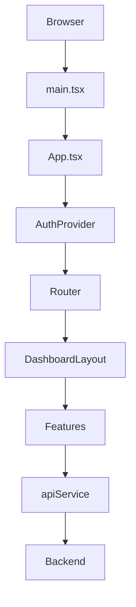

### Patterns Used

* Feature-based architecture
* Atomic design principles
* Centralized API service
* Context + hooks state model

---

## 5. Core Components Documentation

### 5.1 LoginPage

**Location:** `src/features/auth/components/LoginPage.tsx`

**Purpose:** User authentication.

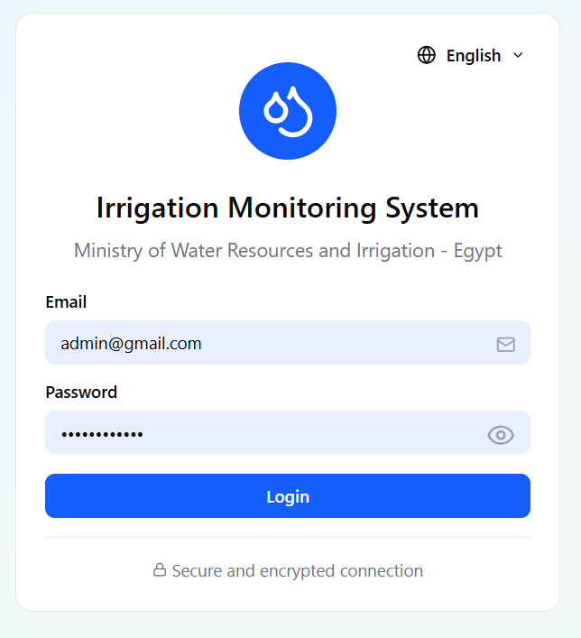

**Features**

* Credential login
* Validation
* Remember me
* i18n support

---

### 5.2 DashboardLayout

**Location:** `src/components/DashboardLayout.tsx`

**Purpose:** Application shell and navigation.

```ts
interface DashboardLayoutProps {
  currentUser: User;
  onLogout: () => void;
  refreshCurrentUser: () => void;
}
```

**Features**

* Responsive sidebar
* Role-based menus
* RTL support
* `<Outlet />` routing

---

### 5.3 DashboardHome

**Admin only**

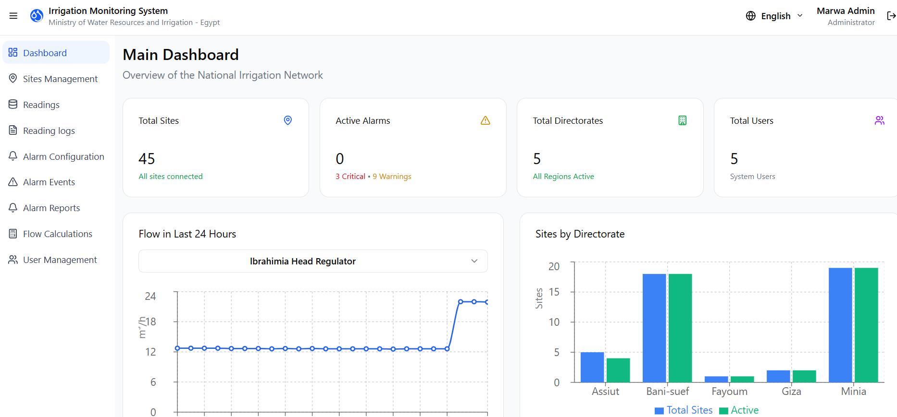

**Features**

* KPI cards
* Charts
* Alarm summaries
* Reading logs

---

### 5.4 SitesManagement

**CRUD + filtering**

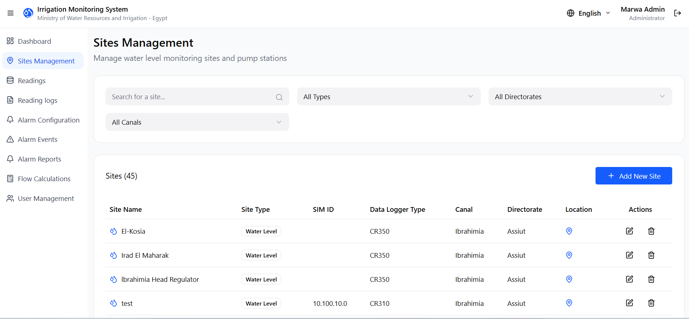

```ts
useSitesData()
```

**Features**

* Search & filters
* Dialog forms
* Pagination
* Role-based actions

---

### 5.5 ReadingsManagement

* Water level readings
* Pump readings
* History & export

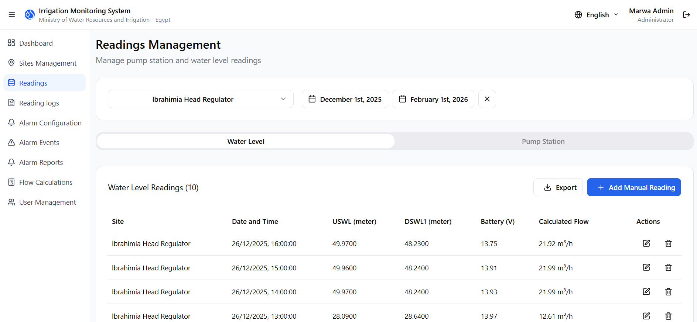

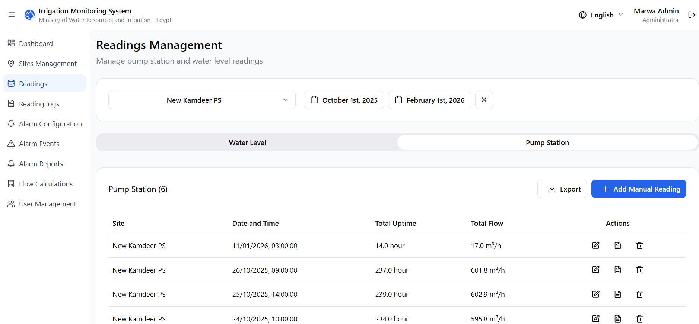

---

### 5.6 ReadingLogs

* Chronological logs
* Filters
* Excel export

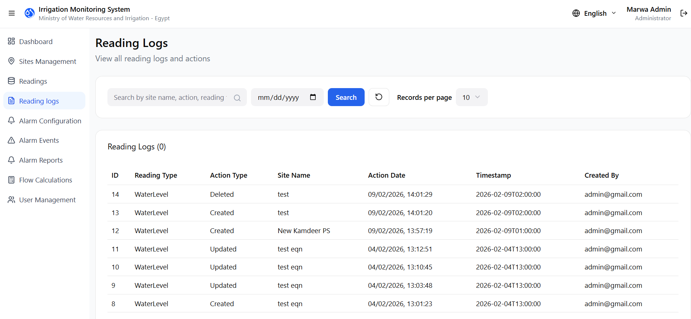

---

### 5.7 AlarmConfiguration

* Threshold alarms
* Communication loss
* Sensor & pump status
* Multi-channel notifications

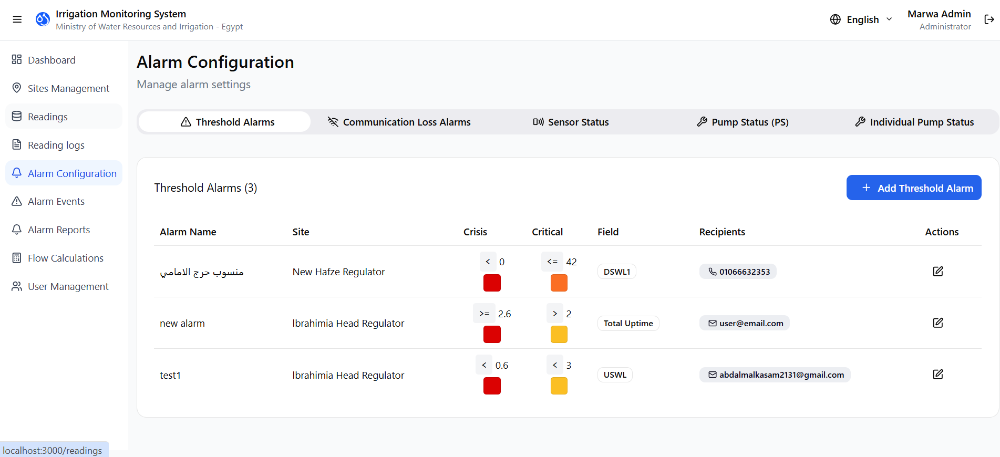

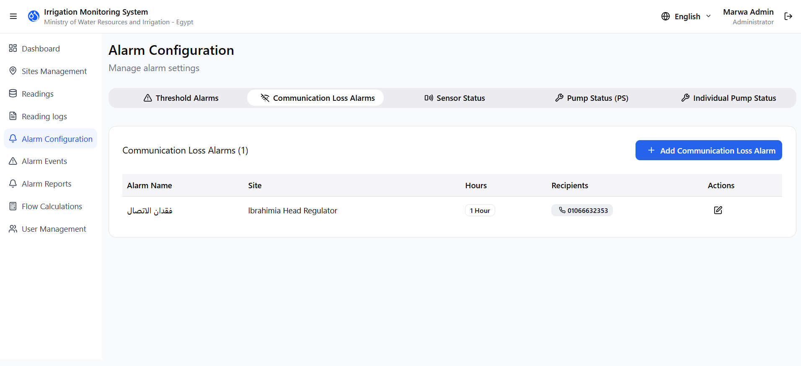

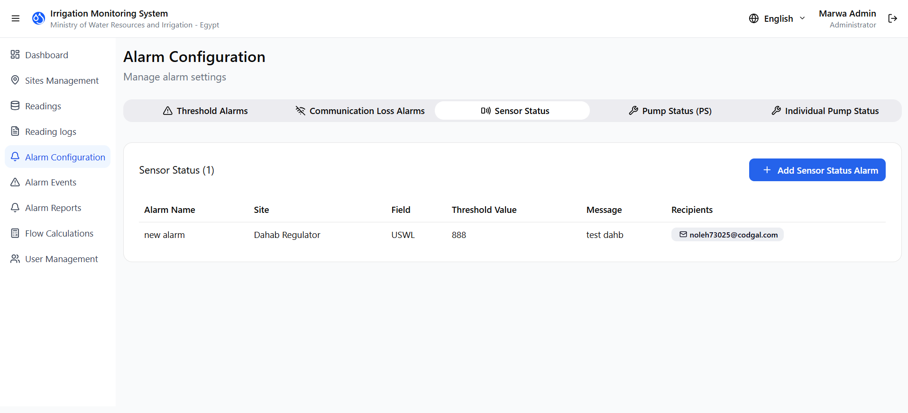

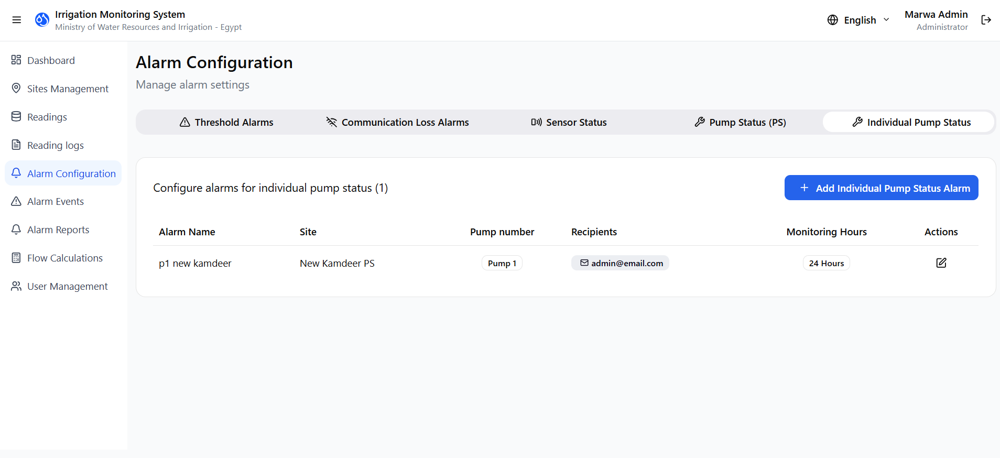

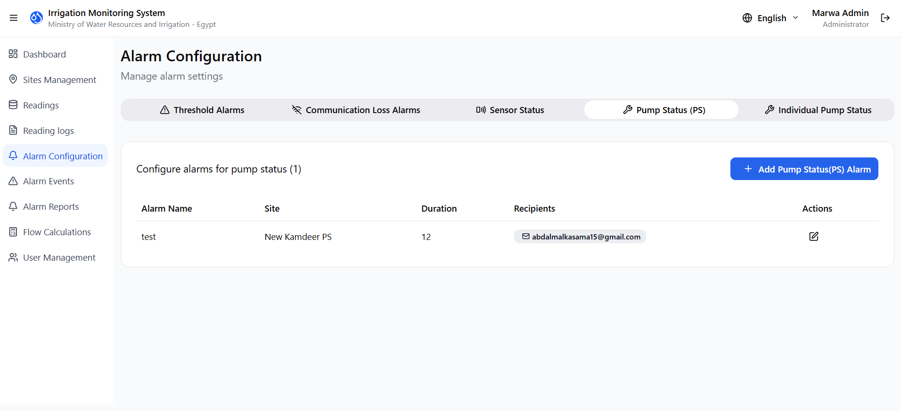

---

### 5.8 AlarmEvents

* Live alarm feed
* Acknowledgement
* Prioritization

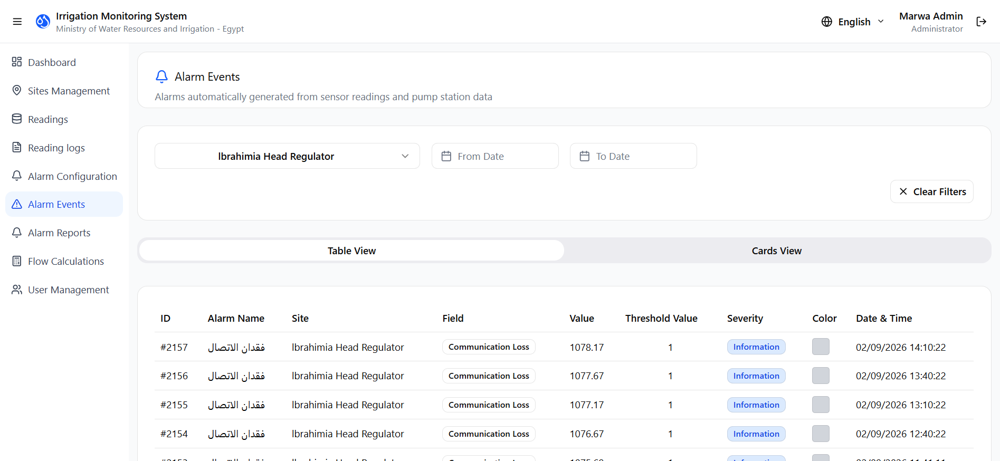

---

### 5.9 AlarmReports

* Date range reports
* Statistics
* Export & scheduling

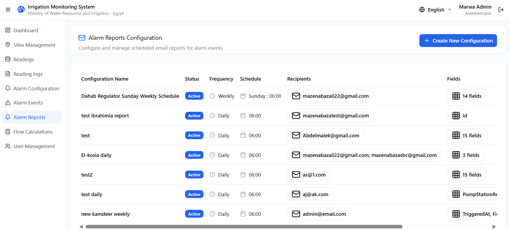

---

### 5.10 FlowCalculations

* Formula validation
* Real-time & historical data

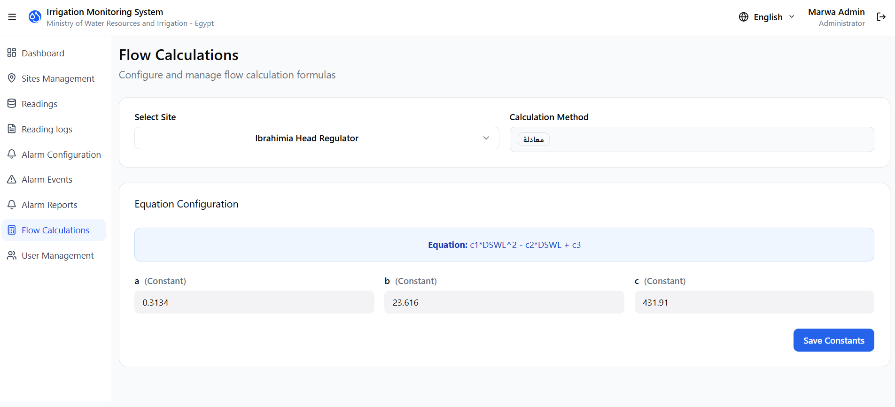

---

### 5.11 UserManagement (Admin)

* User CRUD
* Role assignment
* Activity tracking

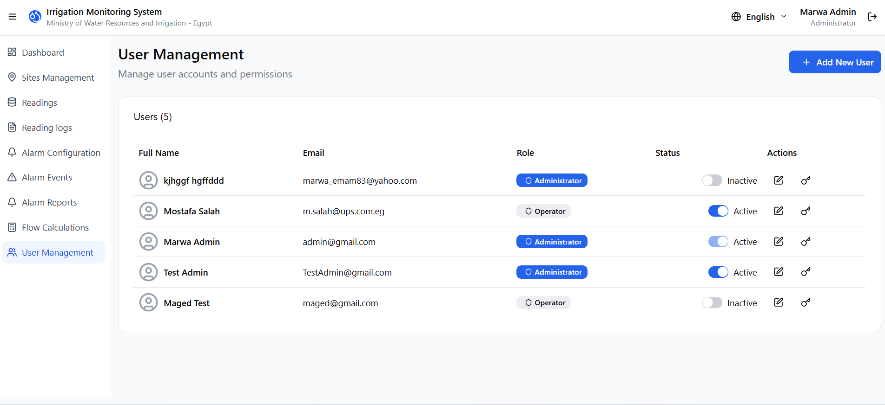

---

## 6. State Management

### Global State – AuthContext

```ts
interface AuthContextType {
  isAuthenticated: boolean;
  currentUser: User | null;
  handleLogout(): Promise<void>;
  refreshCurrentUser(): void;
}
```

### Local State

* Feature hooks
* UI state
* Form state

### Persistence

* Cookies: tokens
* SessionStorage: auth flag
* LocalStorage: language

---

## 7. Routing

### Strategy

* React Router v7
* Nested routes
* Role-based redirects

```tsx
<Route path="/" element={<DashboardLayout />}>
  <Route index element={<DashboardHome />} />
  <Route path="sites" element={<SitesManagement />} />
</Route>
```

---

## 8. Styling System

### Tailwind CSS v4

* Utility-first
* CVA variants
* CSS variables

### RTL Support

* Dynamic `dir`
* Font switching
* Icon mirroring

---

## 9. API Integration

### Axios Service Layer

* Auth interceptors
* Token refresh queue
* Centralized error translation

### Example

```ts
apiService.get<ApiResponse<Site[]>>('/v1/Sites');
```

---

## 10. Internationalization (i18n)

### Setup

* i18next + react-i18next
* Arabic default
* RTL-aware layout

```ts
t('sites.title')
```

---

## 11. Authentication & Authorization

### Flow

* JWT-based auth
* Refresh tokens
* Cookie storage

### Roles

| Feature   | Admin | Operator |
| --------- | ----- | -------- |
| Dashboard | ✅     | ❌        |
| Sites     | ✅     | ✅        |
| Users     | ✅     | ❌        |

---

## 12. Build & Deployment

### Build

```bash
npm run build
```

### Platform

* Vercel
* SPA fallback
* Zero downtime

---

## 13. Performance Optimizations

### Current

* SWC
* Tree shaking
* Memoization

### Recommended

* Route-based lazy loading
* React Query
* Table virtualization
* PWA caching

---

## 14. Accessibility (a11y)

### Current

* Semantic HTML
* ARIA via Radix
* Keyboard support

### Enhancements

* Skip links
* Screen reader announcements
* Explicit icon labels

---

## 15. Security Considerations

* Token refresh isolation
* Role-based UI enforcement
* Centralized logout on auth failure

---

## 16. Troubleshooting Guide

| Issue                   | Resolution                 |
| ----------------------- | -------------------------- |
| Infinite 401 loop       | Check refresh token expiry |
| RTL layout breaks       | Verify `_rtl` key          |
| Missing data            | Confirm `API_BASE_URL`     |
| Blank page after deploy | Check SPA fallback         |

---